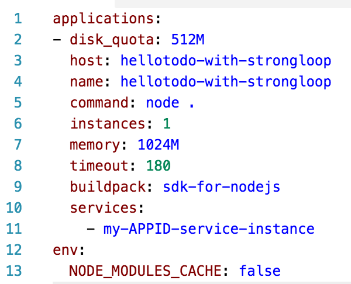

# HelloTodo 
A simple todo list application created with StringLoop, LoopBack and Bluemix Mobile Services

There are two ways of running this application - using a MobileFirst Services Boilerplate on Bluemix or cloning it and deploying to Bluemix manually. 

##Using a MobileFirst Services Boilerplate
Start by creating a mobile backend on IBM Bluemix by using the MobileFirst Services Boilerplate

1. Log in into your IBM Bluemix account
2. Open Bluemix Catalog [https://console.ng.bluemix.net/catalog/](https://console.ng.bluemix.net/catalog/)
3. Find and select the MobileFirst Services Starter under the Boilerplates section
4. Select the space you want to add your mobile backend to
5. Enter the name and host for your mobile backend. 
6. Optionally you can change the plans
7. Click CREATE button

As a result of the above steps IBM Bluemix will provision a Node.JS runtime and populate it with with a default HelloTodo application created using StrongLoop. This application uses LoopBack framework to expose the `/api/Items` API which will be used by both Web UI and the HelloTodo app sample from this Github repository. 

Usually it might take couple of minutes for your application to be provisioned and started. Once back to your Bluemix Application Dashboard click on an application route found in the top part of a screen. You will see the web interface for the HelloTodo backend. Start by following the guided experience steps described in the web UI. Eventually you will try to DELETE a todo item and will discover that this action can only be complete when using the HelloTodo mobile apps sample from this Github repository. This is due to a fact that the mobile backend is by default protected by a Mobile Client Access - a Bluemix service that provides security and monitoring functionality for mobile backends. Start by creating a mobile backend on IBM Bluemix by using the MobileFirst Services Boilerplate

1. Log in into your IBM Bluemix account
2. Open Bluemix Catalog [https://console.ng.bluemix.net/catalog/](https://console.ng.bluemix.net/catalog/)
3. Find and select the MobileFirst Services Starter under the Boilerplates section
4. Select the space you want to add your mobile backend to
5. Enter the name and host for your mobile backend. 
6. Optionally you can change the plans
7. Click CREATE button

As a result of the above steps IBM Bluemix will provision a Node.JS runtime and populate it with with a default HelloTodo application created using StrongLoop. This application uses LoopBack framework to expose the `/api/Items` API which will be used by both Web UI and the HelloTodo app sample from this Github repository. 

Once the above provisioning process is complete you'll be taken to a Bluemix Dashboard for your newly provisioned mobile backend. Click the `Mobile Options` link in top right part of a screen to find your `appRoute` and `appGUID`. Keep this screen open in your browser as you you will need these parameters shortly. 

Open the appRoute URL in your browser. You will see the web interface for the HelloTodo backend. Start by following the guided experience steps described in the web UI. Eventually you will try to DELETE a todo item and will discover that this action can only be complete when using the HelloTodo mobile apps sample from this Github repository. This is due to a fact that the mobile backend is by default protected by a Mobile Client Access - a Bluemix service that provides security and monitoring functionality for mobile backends. Following steps will guide you through obtaining and running the HelloTodo mobile application. Optionally you might want to hit the "View API Reference" button on web UI to see the API specs.

You can continue experiencing Bluemix Mobile Services by using one of the following sample applications

>[HelloTodo for iOS](https://github.com/ibm-bluemix-mobile-services/bms-samples-ios-hellotodo)

>[HelloTodo for Android](https://github.com/ibm-bluemix-mobile-services/bms-samples-android-hellotodo) 

(Optionally you might want to hit the "View API Reference" button on web UI to see the API specs)


## Manually deploying to Bluemix
To manually deploy this application to Bluemix perform the following steps

### Getting setup with Bluemix

1. Make sure you have an [IBM Bluemix](https://console.ng.bluemix.net/) account
2. Make sure you got the [Cloud Foundry CLI](https://www.ng.bluemix.net/docs/cli/downloads.html) tool installed
3. Open terminal and 	verify that cf tool is available by running `cf --version`
1. Setup cf tool to work with a Bluemix API server of your choice, for instance `cf target https://api.ng.bluemix.net`
1. Use following URLs for different Bluemix regions:
	* US-SOUTH `https://api.ng.bluemix.net`
	* UNITED KINGDOM `https://api.en-gb.bluemix.net`
	* SYDNEY `https://api.au-syd.bluemix.net`

1. Login with your Bluemix credentials and pick your organization and space by running `cf login`
1. Make sure you're in a right region, organization and space by running `cf target`	
### Creating an instance of Mobile Client Access service

1. This sample requires an instance of a Mobile Client Access service to be bound. Mobile Client Access is a service that provides authentication and monitoring capabilities to your Bluemix apps. 

1. Run the following command to create a new instance of Mobile Client Access service if your space. 

	```Shell
	cf create-service AdvancedMobileAccess Bronze my-MCA-service-instance
	```
1. Run `cf services` command to make sure a new service instance was added

### Running the HelloTodo sample 

1. Clone this repository to your local disk

	```Shell
	git clone https://github.com/ibm-bluemix-mobile-services/bms-hellotodo-strongloop
	```
1. Edit `manifest.yml` file. Change the `host` property to some unique value. There might be other applications deployed to Bluemix with this host. If you use it - your deployment will fail. 

1. Edit `manifest.yml` file and add the services section. Add the Mobile Client Access service instance name created in previous steps. Final result should look like this
 

1. Use `cf push` command to deploy your application to Bluemix, bind it to Mobile Client Access service instance and start it. 

1. Once deployment succeeds your Bluemix application will be available at `https//{hostname-from-manifest.yml}.mybluemix.net` (Change `ng` to `eu-gb` for if you're in UK region and to `au-syd` if your in SYDNEY region)


## Creating this application with StrongLoop

> We're working on creating a video tutorial. It will be published here once ready

